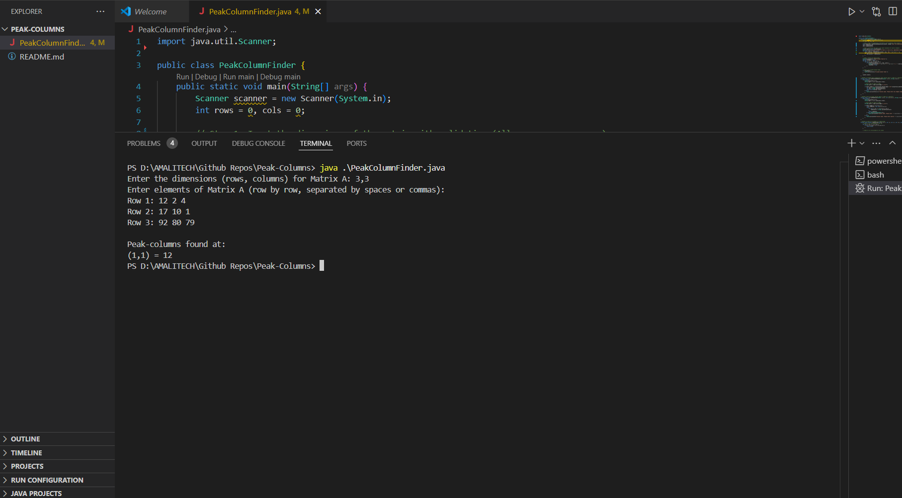

# Peak-Columns
##
The **Peak-Column Finder** program is designed to identify special elements within a user-defined matrix based on specific criteria. The program starts by prompting the user to input the matrix dimensions, which can be entered with either spaces or commas for flexibility. After capturing the number of rows and columns, it collects the matrix elements row by row, also allowing inputs to be separated by spaces or commas. The matrix is then stored in a 2D array for further processing. The program's main task is to identify "peak-columns," which are defined as matrix elements that are the largest in their respective rows and simultaneously the smallest in their respective columns. If any such elements are found, their positions and values are displayed; otherwise, the program indicates that no peak-columns exist.

The core logic of the program lies in its ability to efficiently search for peak-column elements. For each element in the matrix, the program checks two conditions: it must be the maximum value in its row and the minimum value in its column. This dual condition ensures that the element stands out as a peak-column within the matrix's structure. The program is implemented in Java, using input validation techniques to ensure that only valid integers are accepted, preventing common user input errors. The design of this program highlights the flexibility of handling diverse input formats and the use of nested loops to traverse and analyze multidimensional arrays, making it a useful utility for matrix-based data analysis or educational purposes.

##
This shows the sample inputs of data and its corresponding output 